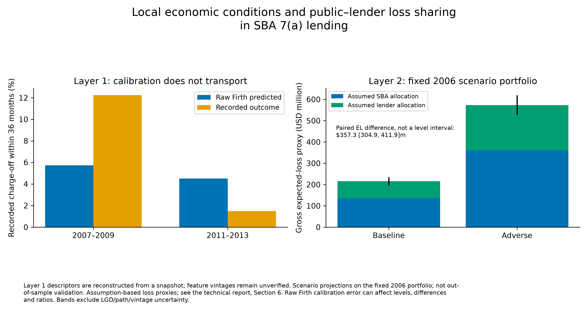

# Local economic conditions and public–lender loss sharing in SBA 7(a) lending

How do recorded charge-off risk and assumption-based loss sharing vary across cohorts and fixed macroeconomic scenarios in SBA 7(a) lending?



## Findings

1. Out-of-time discrimination is modest: Term-free Firth crisis AUC 0.607 [0.587, 0.626] and later-cohort AUC 0.666 [0.638, 0.691]. Crisis prediction is 5.73% versus 12.25% recorded; later prediction is 4.50% versus 1.49% recorded.
2. On the observed fixed portfolio, a conditional +1 pp endpoint unemployment change is associated with 0.535 [0.266, 0.772] pp higher probability; the separately estimated peak-path sensitivity gives 0.679 [0.439, 0.933] pp. Neither is causal or a derivative.
3. Baseline/adverse EL proxies are $215.6m / $572.9m. The paired difference is $357.3 [304.9, 411.9]m; pro-rata SBA shares are 62.80% / 62.97%, not measured public costs.

## Method

We estimate Term-free Firth logistic scorecards for recorded charge-off within 36 months of first disbursement. Layer 1 reconstructs approval descriptors from a snapshot; Layer 2 adds future realized or stipulated state unemployment and house-price paths and is a conditional exercise. ElasticNet/LightGBM benchmark settings were selected on 2003H1 and then held fixed; benchmark calibration uses separate cohorts. Training-state multiplier refits and fitted-model conditional evaluation bands measure different uncertainty components.

## Data and chronology

Official SBA 7(a) FOIA, snapshot 30 June 2026, plus direct BLS LAUS and FHFA all-transactions state HPI. No FRED observations; see [DATA.md](DATA.md) for source terms and frozen hashes. This product uses FHFA data but is neither endorsed nor certified by FHFA.

Layer 1: fit 1991–2002; tune 2003H1; calibrate benchmarks 2003H2; evaluate 2007–2009 and 2011–2013. Layer 2: fit 1991–2009; calibrate LightGBM on 2010; check 2013–2014. **Retrospective conditional validation using realized macro paths.** Calibration labels extend to end-2013; the 2013 cohort was seen previously. The fixed 2006 scenario portfolio enters Layer 2 estimation.

The final estimation protocol was frozen after first-round results had been seen and before any final-round model was estimated. Deviations are logged in DECISIONS.md. This is a post-results design amendment. [Method history](docs/METHOD_HISTORY.md) and [dated decisions](DECISIONS.md) preserve the chronology.

## Explore the complete results

[**Open the research walkthrough notebook**](notebooks/research_walkthrough.ipynb)

The notebook runs from top to bottom using published aggregate files. It follows source selection, sample construction, model design, temporal validation, calibration, macro associations, stress PD/loss allocation, sensitivity analyses and diagnostics. Tables and figures are already rendered for reading on GitHub. A result catalogue gives access to every saved CSV, with named variables for the full coefficient, subgroup and diagnostic tables.

No raw loan downloads or model fits are needed. The private re-estimation guide is disabled by default and explains the additional frozen inputs and separate workspace required.

```sh
uv sync --frozen --group notebook --python 3.11
uv run --group notebook jupyter lab notebooks/research_walkthrough.ipynb
```

For a non-interactive execution check:

```sh
make notebook-check REPORT_PYTHON=.venv/bin/python
```

## Read and reproduce

[Working paper](report/working_paper.pdf) · [Two-page policy note](report/policy_note.pdf) · [Technical report](report/technical_report.pdf) · [Claims/provenance](CLAIMS.md)

The working paper develops the economic motivation, related literature and interpretation of the reviewed results. It uses the same frozen estimates as the technical report, with no new fitting or specification search. [Manuscript, references and reproduction](docs/WORKING_PAPER_2026-10-08.md) document its scope; the current policy note and technical report use the same estimates with the editorial corrections described in the local delivery notes.

```sh
make report        # rebuild in an isolated directory; no fitting
make report-test   # reporting tests; no fitting
make report-check  # public-file hashes, claims and report checks
make paper        # rebuild the working paper in an isolated directory; no fitting
make paper-check  # check manuscript inputs and interpretation
```

Python 3.11 and the locked environment in `uv.lock` are required. Use `uv sync --frozen --python 3.11`, then `make report-check REPORT_PYTHON=.venv/bin/python` and `make report-test REPORT_PYTHON=.venv/bin/python`. PDF rebuilding additionally requires Poppler (`pdfinfo`) and Tectonic with cached TeX packages; set `TECTONIC` to its executable. Rebuilds are offline and write only under ignored `data/editorial-2026-10-09/`. No raw loans, private predictions or fitted models are needed. [Public release and reproduction](PUBLIC_RELEASE.md) explains the exported snapshot and validation scope; [Report build notes](docs/G5_REPRODUCTION.md) remain dated evidence.

## Limitations and future work

- Administrative charge-off and mature EXEMPT classification do not measure delinquency or verify performance; the sample excludes rejected applicants.
- Descriptor/Term vintages remain unverified, rates are largely missing, and revised macro data are not historical information sets.
- Calibration fails across cohorts; average agreement in calibrated Layer 2 LightGBM does not establish group calibration. Post-results amendments and reused/calendar-overlapping cohorts limit confirmatory claims.
- EAD = GrossApproval; full-disbursement proxy, CCF = 100%. LGD is the gross charge-off proxy on the same approval denominator. SBA/lender amounts use assumption-based pro-rata guarantee allocation. Recoveries, amortization, actual payouts and loss-assumption uncertainty are absent; CCF 100% does not make the combined EL necessarily conservative.
- Intervals assume independent states and use only the refits that converged (198 of 199 for the primary scenario model); univariate support checks leave broader dependence and joint path plausibility unresolved. Future rolling-origin recalibration, block Shapley accounting, competing risks or separately authorized policy design require new protocols; none is executed here.

## Sources and reproducibility

The reports present the saved results of the final estimation round dated 8 October 2026. This repository distributes research code, fixed specifications, aggregate results and a results walkthrough. Borrower-level data, fitted models, private predictions and credentials are excluded. Report and notebook commands reproduce presentation from frozen aggregates; full empirical re-estimation requires the separately retained input vintages and model checkpoints. [Reproduction scope](PUBLIC_RELEASE.md), [source rights](DATA.md) and the [current editorial manifest](PUBLIC_EDITORIAL_MANIFEST_2026-10-09.json) give the details.

Hakan Zeki Gülmez · M.Sc. Management & Technology (Economics & Econometrics), Technical University of Munich · [GitHub](https://github.com/hakangulmez) · [LinkedIn](https://www.linkedin.com/in/hakan-zeki-g%C3%BClmez-088700180/)
