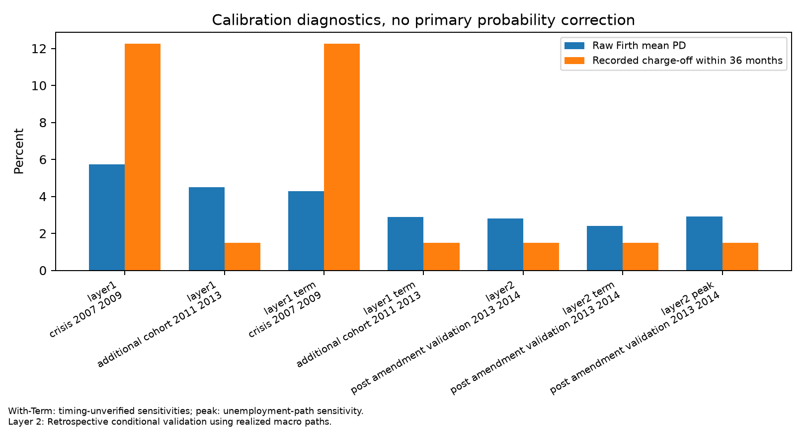
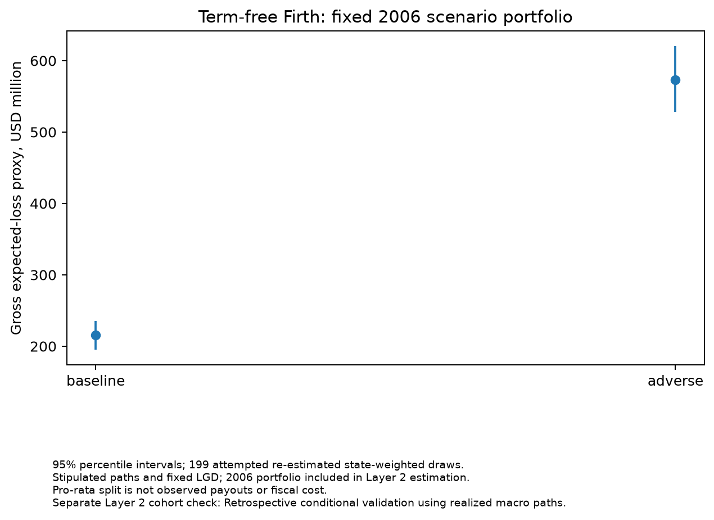

# G2-bis: SBA 7(a) recorded charge-off risk and conditional loss scenarios

Dated completion report — 8 October 2026. Local-only Layers 1–2; stop at G2-bis.

## Decision chronology and headline

This is a design amendment made **after observing failed G2 fits and calibration results**. Protocol v2 and its fixed configuration were committed as `1d39a458ee1bbd0e1604a5b78a2e6f8372fb1c53` before empirical refits. Prior outcomes are not improvement targets. All primary models remain Term-free; with-Term results are qualified sensitivities. The outcome throughout is **recorded charge-off within 36 months**, not delinquency. Coefficients and marginal quantities are associations, not causal effects.

All unit-weight Firth specifications converged: 5 of 5. Finite estimation does not repair transport calibration. The Term-free Layer 1 crisis AUC is 0.607 [0.587, 0.626]; its mean raw prediction is 5.73% against 12.25% recorded. The additional cohort has 4.50% predicted versus 1.49% recorded.

The primary scenario adverse-minus-baseline expected-loss proxy is USD 357.30 [304.86, 411.90] million. Its sign is reported as estimated, without a requirement that adverse losses increase. All point estimates and intervals below are generated from the executed CSV/JSON outputs.

## Population, sources and chronology

Sequential source denominator accounting (inherited from the frozen G2 waterfall; original loans and eligibility rules unchanged):

| step | excluded | remaining |
| --- | --- | --- |
| all_source_rows | 0 | 1961455 |
| wrong_program | 0 | 1961455 |
| cancelled_or_committed | 263913 | 1697542 |
| unknown_status | 0 | 1697542 |
| missing_disbursement | 1795 | 1695747 |
| incomplete_window | 160527 | 1535220 |
| invalid_approval_amount | 1 | 1535219 |
| unmapped_state | 18730 | 1516489 |
| date_or_status_contradiction | 1637 | 1514852 |

Final layer/cohort waterfall (events mean recorded charge-off within 36 months):

| layer | role | years | eligible_n | macro_excluded_n | n | events | non_events |
| --- | --- | --- | --- | --- | --- | --- | --- |
| layer1 | estimation | 1991-2002 | 405443 | 0 | 405443 | 14003 | 391440 |
| layer1 | crisis | 2007-2009 | 181311 | 0 | 181311 | 22212 | 159099 |
| layer1 | additional_check | 2011-2013 | 120002 | 0 | 120002 | 1787 | 118215 |
| layer2 | estimation | 1991-2009 | 888703 | 0 | 888703 | 55088 | 833615 |
| layer2 | tree_calibration | 2010-2010 | 41200 | 0 | 41200 | 918 | 40282 |
| layer2 | heldout_check | 2013-2014 | 87156 | 0 | 87156 | 1289 | 85867 |
| scenario | reference | 2006-2006 | 89002 | 0 | 89002 | 8428 | 80574 |
| layer1 | benchmark_calibration_2003H2 | 2003H2 | 31955 | 0 | 31955 | 1426 | 30529 |

Only 612 missing direct-BLS 2017 unemployment observations were added. Actual retrieval times and new raw-file hashes are in [source_manifest.json](../results/g2-bis-2026-10-08/source_manifest.json). Full unemployment levels through month +36 and HPI quarters through quarter +12 plus quarter −4 are verified; missing interior periods invalidate coverage. FHFA and all earlier BLS observations/source files are unchanged. The new 2017 observations are revised and separately retrieved, producing a mixed retrieval vintage. No loan replacement, general refresh or FRED acquisition occurred. FHFA already covered the required later years. This product uses FHFA data but is neither endorsed nor certified by FHFA.

Layer 1 retains estimation 1991–2002, 2003H2 benchmark calibration, crisis 2007–2009 and additional 2011–2013 check. No new search, tuning or early stopping. Layer 2 estimates 1991–2009 and calibrates only its LightGBM robustness on 2010. Its 2013–2014 cohort check is **Retrospective conditional validation using realized macro paths.** Estimation labels mature by end-2012; calibration labels extend to end-2013, overlapping the calendar period of the 2013 validation cohort. That cohort already entered G2 evaluation: this is post-amendment validation, not a previously untouched confirmatory test. No held-out result informs any model choice. Layer 1 is approval-descriptor prediction under unverified historical feature vintages; Layer 2 conditions on future realized or stipulated macro paths.

InitialInterestRate missingness and explicit exclusion from every shared specification:

| years | eligible_n | missing_n | missing_share |
| --- | --- | --- | --- |
| 1991-2002 | 405443 | 405443 | 1.0 |
| 1991-2009 | 888703 | 852023 | 0.9587263686518444 |

## Pooling, rank, numerical validation and estimator status

Training-frequency pooling uses strictly count/n <0.001 separately in each layer; no outcomes enter mapping and every ProjectState effect is retained. Original-to-pooled maps, counts and resulting-level events/non-events are exported for each specification. Train-only medians, missing indicators and standardization are fixed before the first bootstrap. Constant/redundant columns are dropped without outcomes. Unseen nonstate levels use fitted Other if available; otherwise no unsupported coefficient is introduced (zero dummy vector for logits; missing category for native trees). [Application counts](../results/g2-bis-2026-10-08/preprocessing_application_counts.csv) disclose missing/unseen categories by cohort.

| variant | n | events | full_columns | rank | states | state_dummy_columns | dropped |
| --- | --- | --- | --- | --- | --- | --- | --- |
| layer1 | 405443 | 14003 | 96 | 93 | 51 | 50 | log_approval__missing / guarantee_share__missing / log_jobs__missing |
| layer1_term | 405443 | 14003 | 98 | 94 | 51 | 50 | log_approval__missing / guarantee_share__missing / log_jobs__missing / TermInMonths__missing |
| layer2 | 888703 | 55088 | 115 | 107 | 51 | 50 | log_approval__missing / guarantee_share__missing / log_jobs__missing / u0__missing / du__missing / h0__missing / dh__missing / year_trend__missing |
| layer2_term | 888703 | 55088 | 117 | 108 | 51 | 50 | log_approval__missing / guarantee_share__missing / log_jobs__missing / TermInMonths__missing / u0__missing / du__missing / h0__missing / dh__missing / year_trend__missing |
| layer2_peak | 888703 | 55088 | 115 | 107 | 51 | 50 | log_approval__missing / guarantee_share__missing / log_jobs__missing / u0__missing / peak_du__missing / h0__missing / dh__missing / year_trend__missing |

The independent weighted R coefficient check differed by at most 1.21e-07 from our implementation. Weighted Firth maximizes the explicitly case-weighted binomial log likelihood plus one half log determinant of weighted Fisher information. Numerical rules remain the committed max-iteration, max-step, condition, score, coefficient-change and likelihood-change limits. Analytic weighted intercepts, finite-difference gradients, integer replication, separation and an independent R brglm2 fit validate the implementation. See [firth_implementation_validation.json](../results/g2-bis-2026-10-08/firth_implementation_validation.json) for the independent coefficient comparison and package versions. The ordinary MLE uses exactly the same rows and retained design columns; optimizer success is insufficient when separation or other convergence diagnostics fail.

Fit status:

| variant | family | converged | message | iterations | n |
| --- | --- | --- | --- | --- | --- |
| layer1 | Firth primary | True | all three numerical criteria satisfied | 8 | 405443 |
| layer1 | unpenalized same-design comparator | False | CONVERGENCE: RELATIVE REDUCTION OF F <= FACTR*EPSMCH | 442 | 405443 |
| layer1_term | Firth with-Term sensitivity | True | all three numerical criteria satisfied | 8 | 405443 |
| layer1_term | unpenalized same-design comparator | False | CONVERGENCE: RELATIVE REDUCTION OF F <= FACTR*EPSMCH | 388 | 405443 |
| layer2 | Firth primary | True | all three numerical criteria satisfied | 8 | 888703 |
| layer2 | unpenalized same-design comparator | False | STOP: TOTAL NO. OF ITERATIONS REACHED LIMIT | 500 | 888703 |
| layer2_term | Firth with-Term sensitivity | True | all three numerical criteria satisfied | 8 | 888703 |
| layer2_term | unpenalized same-design comparator | False | STOP: TOTAL NO. OF ITERATIONS REACHED LIMIT | 500 | 888703 |
| layer2_peak | Firth primary | True | all three numerical criteria satisfied | 8 | 888703 |
| layer2_peak | unpenalized same-design comparator | False | STOP: TOTAL NO. OF ITERATIONS REACHED LIMIT | 500 | 888703 |

Same-design ordinary-logit diagnostics (an optimizer convergence message is not a valid-estimate verdict):

| variant | optimizer_success | separation_flag | normalized_gradient | hessian_condition | valid_estimate |
| --- | --- | --- | --- | --- | --- |
| layer1 | True | True | 1.0942876643420226e-06 | 122432317.63711898 | False |
| layer1_term | True | True | 3.911448487152776e-08 | 256873819.11722928 | False |
| layer2 | False | False | 7.807324271959407e-07 | 328328.516691234 | False |
| layer2_term | False | False | 1.3335714120277112e-06 | 342689.7979369777 | False |
| layer2_peak | False | False | 2.0427375819426226e-07 | 331982.1654038593 | False |

Post-pooling binary separation witnesses:

| variant | feature | level | n | events | non_events |
| --- | --- | --- | --- | --- | --- |
| layer1 | BusinessAge | Other | 43 | 0 | 43 |
| layer1_term | BusinessAge | Other | 43 | 0 | 43 |
Layer 1's outcome-pure pooled level invalidates ordinary MLE despite optimizer success. Layer 2's fixed iteration-limit failures do not, by themselves, establish separation. No invalid coefficients or predictions are presented.

Benchmark status (frozen G2 Layer 1 settings; Layer 2 uses corresponding Layer 1 selected rounds; no held-out tuning):

| variant | family | converged | iterations_or_rounds | calibration_n | calibration_start | calibration_end | calibration_failure |
| --- | --- | --- | --- | --- | --- | --- | --- |
| layer1 | elasticnet | True | 457 | 31955 | 2003-07-02 | 2003-12-31 | none |
| layer1 | lightgbm | True | 384 | 31955 | 2003-07-02 | 2003-12-31 | none |
| layer1_term | elasticnet | False | 1000 | 31955 | 2003-07-02 | 2003-12-31 | not run: estimator failed |
| layer1_term | lightgbm | True | 1482 | 31955 | 2003-07-02 | 2003-12-31 | none |
| layer2 | lightgbm | True | 384 | 41200 | 2010-01-01 | 2010-12-31 | none |
| layer2_term | lightgbm | True | 1482 | 41200 | 2010-01-01 | 2010-12-31 | none |

Failed ordinary-logit and ElasticNet estimates supply no valid coefficients or predictions. They remain visible in status tables; no alternative specification is substituted.

## Layer 1 prediction and calibration

| specification | cohort | model | AUC [95%] | AP | Brier | cal. intercept | cal. slope | mean predicted / recorded % |
| --- | --- | --- | --- | --- | --- | --- | --- | --- |
| layer1 | crisis_2007_2009 | firth_raw | 0.607 [0.587, 0.626] | 0.152 | 0.1128 | -0.965 | 0.314 | 5.73 / 12.25 |
| layer1 | crisis_2007_2009 | elasticnet_raw | 0.618 [0.598, 0.635] | 0.153 | 0.1112 | -0.634 | 0.440 | 5.70 / 12.25 |
| layer1 | crisis_2007_2009 | elasticnet_calibrated | 0.618 [0.598, 0.635] | 0.153 | 0.1110 | -0.384 | 0.532 | 5.53 / 12.25 |
| layer1 | crisis_2007_2009 | lightgbm_raw | 0.617 [0.599, 0.634] | 0.159 | 0.1116 | -0.795 | 0.371 | 5.57 / 12.25 |
| layer1 | crisis_2007_2009 | lightgbm_calibrated | 0.617 [0.599, 0.634] | 0.159 | 0.1108 | -0.481 | 0.499 | 5.61 / 12.25 |
| layer1 | additional_cohort_2011_2013 | firth_raw | 0.666 [0.638, 0.691] | 0.027 | 0.0186 | -2.666 | 0.450 | 4.50 / 1.49 |
| layer1 | additional_cohort_2011_2013 | elasticnet_raw | 0.689 [0.661, 0.714] | 0.029 | 0.0168 | -2.096 | 0.660 | 4.49 / 1.49 |
| layer1 | additional_cohort_2011_2013 | elasticnet_calibrated | 0.689 [0.661, 0.714] | 0.029 | 0.0163 | -1.721 | 0.798 | 4.49 / 1.49 |
| layer1 | additional_cohort_2011_2013 | lightgbm_raw | 0.694 [0.667, 0.720] | 0.028 | 0.0176 | -2.349 | 0.558 | 4.44 / 1.49 |
| layer1 | additional_cohort_2011_2013 | lightgbm_calibrated | 0.694 [0.667, 0.720] | 0.028 | 0.0166 | -1.877 | 0.750 | 4.63 / 1.49 |
| layer1_term | crisis_2007_2009 | firth_raw | 0.637 [0.616, 0.654] | 0.170 | 0.1128 | -0.530 | 0.413 | 4.29 / 12.25 |
| layer1_term | crisis_2007_2009 | lightgbm_raw | 0.900 [0.888, 0.910] | 0.517 | 0.0837 | 0.616 | 0.788 | 6.58 / 12.25 |
| layer1_term | crisis_2007_2009 | lightgbm_calibrated | 0.900 [0.888, 0.910] | 0.517 | 0.0807 | 0.298 | 0.718 | 7.98 / 12.25 |
| layer1_term | additional_cohort_2011_2013 | firth_raw | 0.709 [0.683, 0.733] | 0.032 | 0.0159 | -2.041 | 0.564 | 2.89 / 1.49 |
| layer1_term | additional_cohort_2011_2013 | lightgbm_raw | 0.943 [0.933, 0.952] | 0.246 | 0.0129 | -0.476 | 0.929 | 1.92 / 1.49 |
| layer1_term | additional_cohort_2011_2013 | lightgbm_calibrated | 0.943 [0.933, 0.952] | 0.246 | 0.0137 | -0.851 | 0.847 | 2.29 / 1.49 |

Firth probabilities stay raw. Calibration intercept/slope regressions and train-score-decile bins are diagnostics, not a correction to the primary scores. Raw and separately calibrated benchmarks are distinguished. Evaluation bands retain the original 999 state-cluster resamples conditional on each fitted model; they do not include training uncertainty. Training diagnostics are point-only. [Full metrics](../results/g2-bis-2026-10-08/evaluation_metrics.csv) retain AP/Brier and calibration bands and undefined-draw counts; [decile bins](../results/g2-bis-2026-10-08/calibration_deciles.csv) include empty bins.

## Firth coefficients, average associations and conditional macro validation

[Coefficient table](../results/g2-bis-2026-10-08/firth_coefficients.csv) reports all retained columns, references and re-estimated percentile intervals. Numeric coefficients use train-standardized features. [Average associations](../results/g2-bis-2026-10-08/firth_average_associations.csv) convert numeric derivatives to native feature units, leaving log variables in log units; categorical terms are discrete contrasts against frozen references. Layer 1 averages over its estimation loans; Layer 2 over the fixed 2006 portfolio. No absent-training category receives a dummy estimate. Every interval reports its effective denominator.

Selected numeric average associations (probability percentage points per native feature unit):

| variant | feature | value | lower | upper | effective_interval_draws |
| --- | --- | --- | --- | --- | --- |
| layer1 | log_approval | -1.280063641381828 | -1.5093350292127794 | -1.139436891512784 | 196 |
| layer1 | guarantee_share | -4.751877284337826 | -6.472083352295073 | -3.4754360409295897 | 196 |
| layer1 | log_jobs | -0.052007907642954 | -0.2793642492730696 | 0.1576452544078343 | 196 |
| layer1_term | log_approval | -0.4246666695300306 | -0.5974891294986368 | -0.3028621219534027 | 196 |
| layer1_term | guarantee_share | -5.567944973733577 | -6.877260453924089 | -4.483894268570189 | 196 |
| layer1_term | log_jobs | -0.141672698265534 | -0.4037116303944906 | 0.0534276101058859 | 196 |
| layer1_term | TermInMonths | -0.0404197781414984 | -0.0433371927959034 | -0.0385369211670819 | 196 |
| layer2 | log_approval | -2.1462949200383594 | -2.512599898994929 | -1.726365032587611 | 198 |
| layer2 | guarantee_share | 1.9451370789204967 | -3.812490897800359 | 9.107118469106416 | 198 |
| layer2 | log_jobs | 0.5423178819443463 | 0.391137691465966 | 0.6889481647588402 | 198 |
| layer2 | du | 0.5239246149399166 | 0.2626831537407649 | 0.7495395882143367 | 198 |
| layer2 | h0 | -0.2083074625012016 | -0.2371205509428584 | -0.165100383381885 | 198 |
| layer2 | dh | -0.0941193084563244 | -0.1321933541422979 | -0.075061555849784 | 198 |
| layer2_term | log_approval | -1.245399947189707 | -1.492208439838025 | -0.8916481661778569 | 197 |
| layer2_term | guarantee_share | -5.542065795621959 | -9.699802661174363 | -0.8884996460179263 | 197 |
| layer2_term | log_jobs | 0.2197682475039026 | 0.0766311559944055 | 0.3685462918338639 | 197 |
| layer2_term | TermInMonths | -0.1088911054013866 | -0.1209349483215437 | -0.0985745284141734 | 197 |
| layer2_term | du | 0.5603326821093858 | 0.3299940187642982 | 0.7600702699607711 | 197 |
| layer2_term | h0 | -0.2063655390106503 | -0.2338711851110962 | -0.1761044502349541 | 197 |
| layer2_term | dh | -0.0843158462409007 | -0.1267174526940161 | -0.0649544375415521 | 197 |
| layer2_peak | log_approval | -2.1317688870829135 | -2.4957962823731052 | -1.736449219780007 | 198 |
| layer2_peak | guarantee_share | 1.6032239804210913 | -4.022764713019475 | 8.587507751575412 | 198 |
| layer2_peak | log_jobs | 0.5340408002875182 | 0.3784520757093988 | 0.6897251839284204 | 198 |
| layer2_peak | peak_du | 0.6614234047590959 | 0.4320596870547368 | 0.901596763218662 | 198 |
| layer2_peak | h0 | -0.1929556274034768 | -0.2217021092901752 | -0.1463988755141189 | 198 |
| layer2_peak | dh | -0.0900991319966302 | -0.1321235524015896 | -0.0691753377047763 | 198 |

Layer 2 +1 pp unemployment finite-change associations, fixed 2006 observed-macro portfolio:

| variant | feature | value | lower | upper | effective_interval_draws |
| --- | --- | --- | --- | --- | --- |
| layer2 | du | 0.5348835264373184 | 0.2655206356236969 | 0.7717587101305206 | 198 |
| layer2_term | du | 0.5726924629420157 | 0.3342434097888423 | 0.7826594664270126 | 197 |
| layer2_peak | peak_du | 0.6789516180445414 | 0.4389385920842076 | 0.932832835987355 | 198 |

Retrospective conditional validation using realized macro paths. The endpoint Δu and peak-path alternatives keep all other applicable controls fixed. These are conditional associations, not estimates of an intervention on unemployment. Detailed fixed size, sector, age and reported-maturity group associations remain in the CSV.

Layer 2 raw/calibrated validation and calibration diagnostics:

| variant | model | cohort | n | events | mean_predicted | recorded_rate |
| --- | --- | --- | --- | --- | --- | --- |
| layer2 | firth_raw | training_1991_2009 | 888703 | 55088 | 0.0620351636891471 | 0.0619869630236423 |
| layer2 | firth_raw | calibration_2010 | 41200 | 918 | 0.0369957907643444 | 0.0222815533980582 |
| layer2 | firth_raw | post_amendment_validation_2013_2014 | 87156 | 1289 | 0.0279618722904934 | 0.0147895727201799 |
| layer2 | lightgbm_raw | training_1991_2009 | 888703 | 55088 | 0.0619899955485476 | 0.0619869630236423 |
| layer2 | lightgbm_raw | calibration_2010 | 41200 | 918 | 0.0375256367846723 | 0.0222815533980582 |
| layer2 | lightgbm_raw | post_amendment_validation_2013_2014 | 87156 | 1289 | 0.0264051863146544 | 0.0147895727201799 |
| layer2 | lightgbm_calibrated | training_1991_2009 | 888703 | 55088 | 0.0381140037836385 | 0.0619869630236423 |
| layer2 | lightgbm_calibrated | calibration_2010 | 41200 | 918 | 0.0222815541469389 | 0.0222815533980582 |
| layer2 | lightgbm_calibrated | post_amendment_validation_2013_2014 | 87156 | 1289 | 0.0150762873013273 | 0.0147895727201799 |
| layer2_term | firth_raw | training_1991_2009 | 888703 | 55088 | 0.0620346568269205 | 0.0619869630236423 |
| layer2_term | firth_raw | calibration_2010 | 41200 | 918 | 0.0364141878471493 | 0.0222815533980582 |
| layer2_term | firth_raw | post_amendment_validation_2013_2014 | 87156 | 1289 | 0.0239093020940066 | 0.0147895727201799 |
| layer2_term | lightgbm_raw | training_1991_2009 | 888703 | 55088 | 0.0619960261812537 | 0.0619869630236423 |
| layer2_term | lightgbm_raw | calibration_2010 | 41200 | 918 | 0.0262941670046797 | 0.0222815533980582 |
| layer2_term | lightgbm_raw | post_amendment_validation_2013_2014 | 87156 | 1289 | 0.0158962895173295 | 0.0147895727201799 |
| layer2_term | lightgbm_calibrated | training_1991_2009 | 888703 | 55088 | 0.0537320859759446 | 0.0619869630236423 |
| layer2_term | lightgbm_calibrated | calibration_2010 | 41200 | 918 | 0.0222815534900168 | 0.0222815533980582 |
| layer2_term | lightgbm_calibrated | post_amendment_validation_2013_2014 | 87156 | 1289 | 0.0129325815849308 | 0.0147895727201799 |
| layer2_peak | firth_raw | training_1991_2009 | 888703 | 55088 | 0.0620351378251395 | 0.0619869630236423 |
| layer2_peak | firth_raw | calibration_2010 | 41200 | 918 | 0.037281078316297 | 0.0222815533980582 |
| layer2_peak | firth_raw | post_amendment_validation_2013_2014 | 87156 | 1289 | 0.029237062273794 | 0.0147895727201799 |

Layer 2 held-out diagnostic scores:

| variant | model | metric | value | lower | upper | undefined_draws |
| --- | --- | --- | --- | --- | --- | --- |
| layer2 | firth_raw | auc | 0.6666561199888369 | 0.6349517778852122 | 0.6911696226232152 | 0 |
| layer2 | firth_raw | average_precision | 0.0265611766282754 | 0.0218160699481768 | 0.03128827194244 | 0 |
| layer2 | firth_raw | brier | 0.0147957387076506 | 0.0130690265863488 | 0.0163905296884089 | 0 |
| layer2 | firth_raw | calibration_intercept | -1.226237632109841 | -1.804596992688968 | -0.7723808066916208 | 0 |
| layer2 | firth_raw | calibration_slope | 0.8297887342654966 | 0.6810150865983827 | 0.9451119929171478 | 0 |
| layer2 | lightgbm_raw | auc | 0.7102829196320652 | 0.6787474824701808 | 0.7356357820364549 | 0 |
| layer2 | lightgbm_raw | average_precision | 0.0312473682152283 | 0.0261888953479181 | 0.0362277864090619 | 0 |
| layer2 | lightgbm_raw | brier | 0.0147171799447666 | 0.012991735265064 | 0.0163291159800302 | 0 |
| layer2 | lightgbm_raw | calibration_intercept | -0.8725166832927346 | -1.239326568875132 | -0.5868843529146108 | 0 |
| layer2 | lightgbm_raw | calibration_slope | 0.9175528360936768 | 0.8332243485839063 | 0.9921025599529476 | 0 |
| layer2 | lightgbm_calibrated | auc | 0.7102829196320652 | 0.6787474824701808 | 0.7356357820364549 | 0 |
| layer2 | lightgbm_calibrated | average_precision | 0.0312473682152283 | 0.0261888953479181 | 0.0362277864090619 | 0 |
| layer2 | lightgbm_calibrated | brier | 0.0144657096433547 | 0.0126967020588096 | 0.0160594416736812 | 0 |
| layer2 | lightgbm_calibrated | calibration_intercept | -0.431348588121204 | -0.8349388029206917 | -0.1116145241972773 | 0 |
| layer2 | lightgbm_calibrated | calibration_slope | 0.893876022381249 | 0.8117235729271403 | 0.966502042389702 | 0 |
| layer2_term | firth_raw | auc | 0.7366620250743561 | 0.7108451638531553 | 0.7573838315887913 | 0 |
| layer2_term | firth_raw | average_precision | 0.0367098549096943 | 0.0306693537963226 | 0.0427735131616738 | 0 |
| layer2_term | firth_raw | brier | 0.0145609599419464 | 0.0128484628921665 | 0.0161120670977776 | 0 |
| layer2_term | firth_raw | calibration_intercept | -0.4688500886915789 | -0.9167163927504556 | -0.1119541061515649 | 0 |
| layer2_term | firth_raw | calibration_slope | 1.0084372221430524 | 0.9052307853464296 | 1.098505987519991 | 0 |
| layer2_term | lightgbm_raw | auc | 0.9642695932149674 | 0.955948176828228 | 0.9703700710093676 | 0 |
| layer2_term | lightgbm_raw | average_precision | 0.378010401980446 | 0.3011798303295339 | 0.4323043308489632 | 0 |
| layer2_term | lightgbm_raw | brier | 0.0112173270281152 | 0.0102320264029564 | 0.0122425226828189 | 0 |
| layer2_term | lightgbm_raw | calibration_intercept | -0.009862381665197 | -0.2460187316117833 | 0.228912120658562 | 0 |
| layer2_term | lightgbm_raw | calibration_slope | 1.0405482807920858 | 0.9989293870154894 | 1.0958655701095494 | 0 |
| layer2_term | lightgbm_calibrated | auc | 0.9642695932149674 | 0.955948176828228 | 0.9703700710093676 | 0 |
| layer2_term | lightgbm_calibrated | average_precision | 0.378010401980446 | 0.3011798303295339 | 0.4323043308489632 | 0 |
| layer2_term | lightgbm_calibrated | brier | 0.0112205799441779 | 0.0102387424597048 | 0.0122383479415647 | 0 |
| layer2_term | lightgbm_calibrated | calibration_intercept | 0.257719739562332 | 0.0132998175989402 | 0.5071478744027135 | 0 |
| layer2_term | lightgbm_calibrated | calibration_slope | 1.032663924913895 | 0.9913603823572744 | 1.0875620686681515 | 0 |
| layer2_peak | firth_raw | auc | 0.666142353425625 | 0.6336041877334377 | 0.6911916096940508 | 0 |
| layer2_peak | firth_raw | average_precision | 0.0266558855242524 | 0.0217587436850541 | 0.031284819967764 | 0 |
| layer2_peak | firth_raw | brier | 0.0148453817777521 | 0.0131134845296137 | 0.0164374602692632 | 0 |
| layer2_peak | firth_raw | calibration_intercept | -1.248745596517555 | -1.830008606036565 | -0.7996292328310032 | 0 |
| layer2_peak | firth_raw | calibration_slope | 0.8347470905206591 | 0.6854687106141275 | 0.9523686787669668 | 0 |

## Fixed portfolio stress, allocation and retained sensitivities

EAD = GrossApproval, full-disbursement proxy, CCF = 100%; gross charge-off LGD proxy; assumption-based pro-rata guarantee allocation. The pro-rata split is neither observed guarantee payouts nor measured fiscal costs. The fixed 2006 portfolio, exposure, guarantee shares and scenario paths are unchanged. Its inclusion in expanded Layer 2 estimation is explicit; it is a scenario portfolio, not out-of-sample performance. PD averages use all reference loans; loss uses the valid-share population recorded in the loss table. LGD is the original ratio-of-sums charge-off/approval proxy with fixed loan-type/size pooling, not net-of-recovery loss.

Primary overall projections and paired adverse-minus-baseline differences (PD fractions except explicitly labelled pp; monetary quantities in USD):

| scenario | metric | value | lower | upper | effective_interval_draws | pd_n | loss_n |
| --- | --- | --- | --- | --- | --- | --- | --- |
| baseline | pd | 0.05164571438458 | 0.0460946916572894 | 0.0579095754222327 | 198 | 89002 | 89002 |
| baseline | expected_loss_usd | 215576590.272784 | 194854812.7767432 | 234993052.0924275 | 198 | 89002 | 89002 |
| baseline | sba_loss_usd | 135376308.15806857 | 123959332.57961404 | 146812744.31009713 | 198 | 89002 | 89002 |
| baseline | lender_loss_usd | 80200282.11471793 | 70788364.41353571 | 88693283.88602954 | 198 | 89002 | 89002 |
| baseline | loss_rate | 0.0167451421317834 | 0.0151355559102214 | 0.0182533365626113 | 198 | 89002 | 89002 |
| adverse | pd | 0.1278397067937711 | 0.1246427438001284 | 0.1334243498394141 | 198 | 89002 | 89002 |
| adverse | expected_loss_usd | 572872825.892835 | 528205041.6226377 | 620282002.1942548 | 198 | 89002 | 89002 |
| adverse | sba_loss_usd | 360710273.4397001 | 328191919.51072204 | 393904159.6402093 | 198 | 89002 | 89002 |
| adverse | lender_loss_usd | 212162552.4531323 | 199488704.5185952 | 227033073.0379224 | 198 | 89002 | 89002 |
| adverse | loss_rate | 0.0444985092345764 | 0.0410288913351104 | 0.0481810676910095 | 198 | 89002 | 89002 |
| adverse_minus_baseline | pd_change_pp | 7.619399240919117 | 6.771643060557051 | 8.617251869536409 | 198 | 89002 | 89002 |
| adverse_minus_baseline | expected_loss_usd_change | 357296235.620051 | 304857241.88833964 | 411901510.3718731 | 198 | 89002 | 89002 |
| adverse_minus_baseline | sba_loss_usd_change | 225333965.28163156 | 189402204.477427 | 261738476.5060768 | 198 | 89002 | 89002 |
| adverse_minus_baseline | lender_loss_usd_change | 131962270.33841436 | 114462993.93077998 | 151136406.24844715 | 198 | 89002 | 89002 |
| adverse_minus_baseline | loss_rate_change | 0.0277533671027929 | 0.0236801121998645 | 0.031994890200024 | 198 | 89002 | 89002 |

EAD = GrossApproval, full-disbursement proxy, CCF = 100%; gross charge-off LGD proxy; assumption-based pro-rata guarantee allocation. Term/revolving split:

| scenario | group_value | metric | value | lower | upper | effective_interval_draws |
| --- | --- | --- | --- | --- | --- | --- |
| baseline | revolving | pd | 0.0556461240716346 | 0.0490193559090568 | 0.0619290973178287 | 198 |
| baseline | revolving | expected_loss_usd | 68598936.12120883 | 59847054.02669925 | 76112873.11683433 | 198 |
| baseline | revolving | sba_loss_usd | 35484452.42750635 | 31039855.09553024 | 39143904.85004986 | 198 |
| baseline | revolving | lender_loss_usd | 33114483.693702567 | 28811770.430919617 | 36932487.342811234 | 198 |
| baseline | revolving | loss_rate | 0.039701652548468 | 0.0346364984555905 | 0.0440503455856938 | 198 |
| baseline | term | pd | 0.0487726788406068 | 0.0435291672654376 | 0.0551972937259328 | 198 |
| baseline | term | expected_loss_usd | 146977654.15157703 | 133423403.44116576 | 159135132.06880164 | 198 |
| baseline | term | sba_loss_usd | 99891855.73056298 | 90528563.2094296 | 108012327.63620149 | 198 |
| baseline | term | lender_loss_usd | 47085798.42101472 | 41805000.17856024 | 52115369.9448495 | 198 |
| baseline | term | loss_rate | 0.0131864446364398 | 0.0119703932739861 | 0.0142771812548708 | 198 |
| adverse | revolving | pd | 0.1451517849582814 | 0.1382883316724912 | 0.1546528882546567 | 198 |
| adverse | revolving | expected_loss_usd | 182564501.85972276 | 170316955.9160194 | 198793652.7084261 | 198 |
| adverse | revolving | sba_loss_usd | 94142849.80799976 | 87212487.2900811 | 102816498.83282074 | 198 |
| adverse | revolving | lender_loss_usd | 88421652.05172317 | 83104468.62593809 | 96000222.108248 | 198 |
| adverse | revolving | loss_rate | 0.1056592540693637 | 0.0985709835928486 | 0.1150518794449734 | 198 |
| adverse | term | pd | 0.1154064262556192 | 0.1111812973150352 | 0.1230329060528721 | 198 |
| adverse | term | expected_loss_usd | 390308324.0331177 | 358107512.0687028 | 432077053.3512785 | 198 |
| adverse | term | sba_loss_usd | 266567423.63170472 | 241350197.94056204 | 295996778.0871538 | 198 |
| adverse | term | lender_loss_usd | 123740900.40141124 | 116031600.80089612 | 135780853.8497041 | 198 |
| adverse | term | loss_rate | 0.0350174258509833 | 0.0321284545534875 | 0.0387648052731664 | 198 |
| adverse_minus_baseline | revolving | pd_change_pp | 8.950566088664678 | 7.85429547946732 | 10.091978090410455 | 198 |
| adverse_minus_baseline | revolving | expected_loss_usd_change | 113965565.73851392 | 98012508.00994888 | 132494540.0056642 | 198 |
| adverse_minus_baseline | revolving | sba_loss_usd_change | 58658397.380493395 | 50129168.92915013 | 68511665.82921562 | 198 |
| adverse_minus_baseline | revolving | lender_loss_usd_change | 55307168.3580206 | 47886675.066461936 | 64132276.973277606 | 198 |
| adverse_minus_baseline | revolving | loss_rate_change | 0.0659576015208956 | 0.0567247651120913 | 0.0766812503123886 | 198 |
| adverse_minus_baseline | term | pd_change_pp | 6.663374741501235 | 5.952103106005498 | 7.5491814330043985 | 198 |
| adverse_minus_baseline | term | expected_loss_usd_change | 243330669.8815407 | 203881060.15813 | 286269044.2792148 | 198 |
| adverse_minus_baseline | term | sba_loss_usd_change | 166675567.90114173 | 137978572.9459053 | 198187554.6116655 | 198 |
| adverse_minus_baseline | term | lender_loss_usd_change | 76655101.98039654 | 65907576.04049668 | 89775959.44663179 | 198 |
| adverse_minus_baseline | term | loss_rate_change | 0.0218309812145434 | 0.0182916670409043 | 0.0256832980857171 | 198 |

EAD = GrossApproval, full-disbursement proxy, CCF = 100%; gross charge-off LGD proxy; assumption-based pro-rata guarantee allocation. All predeclared estimator/path/LGD sensitivities, overall:

| variant | scenario | lgd_variant | metric | value | lower | upper | effective_interval_draws |
| --- | --- | --- | --- | --- | --- | --- | --- |
| layer2 | baseline | primary | pd | 0.05164571438458 | 0.0460946916572894 | 0.0579095754222327 | 198 |
| layer2 | baseline | primary | expected_loss_usd | 215576590.272784 | 194854812.7767432 | 234993052.0924275 | 198 |
| layer2 | adverse | primary | pd | 0.1278397067937711 | 0.1246427438001284 | 0.1334243498394141 | 198 |
| layer2 | adverse | primary | expected_loss_usd | 572872825.892835 | 528205041.6226377 | 620282002.1942548 | 198 |
| layer2 | adverse | capped | pd | 0.1278397067937711 | 0.1246427438001284 | 0.1334243498394141 | 198 |
| layer2 | adverse | capped | expected_loss_usd | 568448525.4328047 | 524048690.32792 | 615594595.4958498 | 198 |
| layer2 | adverse | downturn | pd | 0.1278397067937711 | 0.1246427438001284 | 0.1334243498394141 | 198 |
| layer2 | adverse | downturn | expected_loss_usd | 612605849.6073214 | 561086246.8245423 | 666288367.2790487 | 198 |
| layer2 | adverse_minus_baseline | primary | pd_change_pp | 7.619399240919117 | 6.771643060557051 | 8.617251869536409 | 198 |
| layer2 | adverse_minus_baseline | primary | expected_loss_usd_change | 357296235.620051 | 304857241.88833964 | 411901510.3718731 | 198 |
| layer2_term | baseline | primary | pd | 0.0533060397393877 | 0.0477118282431743 | 0.0583469997311571 | 197 |
| layer2_term | baseline | primary | expected_loss_usd | 220361422.61404744 | 199749322.107454 | 237063820.87162292 | 197 |
| layer2_term | adverse | primary | pd | 0.127299582995321 | 0.1232829327300511 | 0.1334436477822702 | 197 |
| layer2_term | adverse | primary | expected_loss_usd | 555427038.4869365 | 516294949.29367054 | 603064864.1054243 | 197 |
| layer2_term | adverse | capped | pd | 0.127299582995321 | 0.1232829327300511 | 0.1334436477822702 | 197 |
| layer2_term | adverse | capped | expected_loss_usd | 550837834.9394128 | 512021184.37919015 | 598150027.6808759 | 197 |
| layer2_term | adverse | downturn | pd | 0.127299582995321 | 0.1232829327300511 | 0.1334436477822702 | 197 |
| layer2_term | adverse | downturn | expected_loss_usd | 584556749.551128 | 541664361.9514968 | 636529812.450367 | 197 |
| layer2_term | adverse_minus_baseline | primary | pd_change_pp | 7.3993543255933245 | 6.553438481067359 | 8.503874713385175 | 197 |
| layer2_term | adverse_minus_baseline | primary | expected_loss_usd_change | 335065615.87288904 | 285099286.93496215 | 392220985.3234652 | 197 |
| layer2_peak | baseline | primary | pd | 0.0485538439888418 | 0.0429264913290018 | 0.054683290418549 | 198 |
| layer2_peak | baseline | primary | expected_loss_usd | 202718651.03915137 | 181136222.92466012 | 223186796.87388015 | 198 |
| layer2_peak | adverse | primary | pd | 0.1282547883251439 | 0.1254310810017819 | 0.1336976402392192 | 198 |
| layer2_peak | adverse | primary | expected_loss_usd | 575995935.0309867 | 531321265.7631174 | 622317189.5766617 | 198 |
| layer2_peak | adverse | capped | pd | 0.1282547883251439 | 0.1254310810017819 | 0.1336976402392192 | 198 |
| layer2_peak | adverse | capped | expected_loss_usd | 571552212.662203 | 527152126.7229662 | 617628461.5149188 | 198 |
| layer2_peak | adverse | downturn | pd | 0.1282547883251439 | 0.1254310810017819 | 0.1336976402392192 | 198 |
| layer2_peak | adverse | downturn | expected_loss_usd | 616094593.6547616 | 564809487.4438043 | 668827849.904559 | 198 |
| layer2_peak | adverse_minus_baseline | primary | pd_change_pp | 7.970094433630217 | 7.187608922927946 | 8.926350491404254 | 198 |
| layer2_peak | adverse_minus_baseline | primary | expected_loss_usd_change | 373277283.99183536 | 320578857.7790331 | 427754322.7699569 | 198 |

The downturn proxy still uses only 1991 and 2000–2001 cohorts, with 3,221 valid training charge-offs and original sparse-cell rules. Per-loan capped LGD is a separate fixed sensitivity; primary LGD stays uncapped. Primary, capped and downturn tables numerically reconcile with their G2 versions. Peak unemployment replaces Δu rather than augmenting it. With-Term fits remain timing-qualified sensitivities. Old-extract CCF remains unavailable because its licence/cutoff admissibility conditions are unmet; no extract was acquired. Urban/rural fields are absent and historical rate coefficients are unsupported. [Secondary trees](../results/g2-bis-2026-10-08/benchmark_stress_point.csv) report raw and calibrated point projections without pretending to have Firth training-refit intervals.

Univariate support checks — state-specific and pooled-global separately:

| variant | scenario | scope | flagged_loan_n | flagged_fraction | flagged_approval_usd | n |
| --- | --- | --- | --- | --- | --- | --- |
| layer2 | baseline | state_specific | 0 | 0.0 | 0.0 | 89002 |
| layer2 | baseline | pooled_global | 0 | 0.0 | 0.0 | 89002 |
| layer2 | adverse | state_specific | 990 | 0.0111233455427967 | 99554858.0 | 89002 |
| layer2 | adverse | pooled_global | 0 | 0.0 | 0.0 | 89002 |
| layer2_term | baseline | state_specific | 0 | 0.0 | 0.0 | 89002 |
| layer2_term | baseline | pooled_global | 0 | 0.0 | 0.0 | 89002 |
| layer2_term | adverse | state_specific | 990 | 0.0111233455427967 | 99554858.0 | 89002 |
| layer2_term | adverse | pooled_global | 0 | 0.0 | 0.0 | 89002 |
| layer2_peak | baseline | state_specific | 0 | 0.0 | 0.0 | 89002 |
| layer2_peak | baseline | pooled_global | 0 | 0.0 | 0.0 | 89002 |
| layer2_peak | adverse | state_specific | 990 | 0.0111233455427967 | 99554858.0 | 89002 |
| layer2_peak | adverse | pooled_global | 0 | 0.0 | 0.0 | 89002 |

Flags compare each input against univariate training ranges; [feature-level counts](../results/g2-bis-2026-10-08/scenario_support_by_feature.csv) expose which variables trigger them. Neither a lack of flags nor a tree probability demonstrates joint support. Approval-dollar exposure is reported even when one loan triggers several feature flags; the union summary counts each flagged loan once.

## Term timing audit

All applicable eligible date-valid charge-offs and PIF records are included, including later-than-36-month charge-offs. Elapsed months use actual elapsed days/(365.25/12); difference is TermInMonths minus elapsed months. Frozen raw Term alone is reread to distinguish invalid/missing values before historical preprocessing.

| scope | group | n | valid_n | date_missing_n | date_invalid_n | term_missing_n | term_invalid_n | match_abs_le_3_n | match_abs_le_3_share | charge_off_after_label_window_n | verdict |
| --- | --- | --- | --- | --- | --- | --- | --- | --- | --- | --- | --- |
| overall | all | 1368295 | 1366978 | 0 | 0 | 0 | 1317 | 176336 | 0.1289969553277375 | 151175 | Timing unverifiable. |
| status | CHGOFF | 217195 | 216172 | 0 | 0 | 0 | 1023 | 10066 | 0.0465647724959754 | 151175 | Timing unverifiable. |
| status | PIF | 1151100 | 1150806 | 0 | 0 | 0 | 294 | 166270 | 0.1444813461174168 | 0 | Timing unverifiable. |

Verdict: **Timing unverifiable.** The valid charge-off matching share is 4.66% and does not meet the predeclared strong-update descriptive flag. This does not verify original approval-time measurement. No supporting metadata/original vintage evidence was verified; PIF coincidence alone also cannot prove updating. Primary models stay Term-free. Full difference distributions, counts by approval year/loan type/status and all three classification definitions are in [term_audit_summary.csv](../results/g2-bis-2026-10-08/term_audit_summary.csv) and [evidence](../results/g2-bis-2026-10-08/term_audit_evidence.json).

## Uncertainty, failures, runtime and preservation

Positive state-weighted multiplier inference uses one independent Exp(1) weight per state per scheduled draw, normalized separately within each layer to the original loan count. Every state remains present. Underlying weights are shared across comparisons and paired scenarios. Each fit re-estimates the weighted likelihood and weighted Firth penalty with frozen maps/columns. Percentile intervals use successful fully defined draws only, never silently redrawn failures. State clusters are assumed independent. LGD, scenario paths, portfolio composition, preprocessing, exposure allocation and source vintages are held fixed; their uncertainty is excluded. Conditional 999-draw evaluation intervals remain distinct.

| variant | attempted | successful | failed | failure_reasons | point_converged |
| --- | --- | --- | --- | --- | --- |
| layer1 | 199 | 196 | 3 | {'iteration limit': 3} | True |
| layer1_term | 199 | 196 | 3 | {'iteration limit': 3} | True |
| layer2 | 199 | 198 | 1 | {'iteration limit': 1} | True |
| layer2_term | 199 | 197 | 2 | {'iteration limit': 2} | True |
| layer2_peak | 199 | 198 | 1 | {'iteration limit': 1} | True |

Pilot wall time 267.7 seconds; peak RSS 3.52 GiB. Its first five scheduled draws per model were retained in 199. Projected remaining time was 102.5 minutes. Actual remaining execution wall time was 141.2 minutes with peak RSS 2.85 GiB; cached pilot fits are not counted as new attempts. Individual fit/association runtimes and failure messages are in [bootstrap_attempts.csv](../results/g2-bis-2026-10-08/bootstrap_attempts.csv). Benchmarks and term/diagnostic work ran separately; full pipeline runtime is not a clean-build claim.

Software/statistical checks:

| tests_passed | test_seconds | package_coverage_percent | statistical_core_coverage_percent | lint | mypy | preservation_entries | repo_disk_GiB | portfolio_disk_GiB |
| --- | --- | --- | --- | --- | --- | --- | --- | --- |
| 78 | 153.44 | 89.41684665226782 | 95.90697674418605 | passed | passed | 223 | 2.0557212829589844 | 16.794612884521484 |

[Completed-draw identity checks](../results/g2-bis-2026-10-08/statistical_completion_checks.json) independently verify the saved state-weight/configuration hashes, finite successful-draw quantities, percentile coefficient intervals, effective denominators and paired scenario/allocation accounting without any new estimation.

Preservation checks passed for 223 baseline entries (148 public; 75 private). Protocol v1, G2 outputs and private frozen files have identical hashes. DECISIONS.md alone has an authorized appended entry; its exact former bytes are retained and checked in the dated version. Existing implementation, Makefile and original reports remain unchanged. [Preservation ledger](../results/g2-bis-2026-10-08/preservation_checks.csv) and [private run lineage](../results/g2-bis-2026-10-08/private_run_lineage.json) contain hashes, not loan data. No raw/private data or secrets were committed.

## G2 → G2-bis interpretation

EAD = GrossApproval, full-disbursement proxy, CCF = 100%; gross charge-off LGD proxy; assumption-based pro-rata guarantee allocation. Monetary rows below carry this same disclosure in the CSV.

| comparison | G2 | G2_bis | change_components |
| --- | --- | --- | --- |
| Layer 1 no-Term elasticnet crisis auc | 0.62271619625887 | 0.6176007755470672 | Same cohorts/frozen hyperparameters/calibration years; new training-frequency pooling and rate exclusion; no new search |
| Layer 1 no-Term elasticnet crisis average_precision | 0.1547293469450872 | 0.1525778113713039 | Same cohorts/frozen hyperparameters/calibration years; new training-frequency pooling and rate exclusion; no new search |
| Layer 1 no-Term elasticnet crisis brier | 0.1111224774046677 | 0.1109999720279958 | Same cohorts/frozen hyperparameters/calibration years; new training-frequency pooling and rate exclusion; no new search |
| Layer 1 no-Term lightgbm crisis auc | 0.6271339571260951 | 0.6169495440608354 | Same cohorts/frozen hyperparameters/calibration years; new training-frequency pooling and rate exclusion; no new search |
| Layer 1 no-Term lightgbm crisis average_precision | 0.1647493348935517 | 0.1585142495767388 | Same cohorts/frozen hyperparameters/calibration years; new training-frequency pooling and rate exclusion; no new search |
| Layer 1 no-Term lightgbm crisis brier | 0.1107431582116656 | 0.110757389093359 | Same cohorts/frozen hyperparameters/calibration years; new training-frequency pooling and rate exclusion; no new search |
| G2 Layer 2 LightGBM crisis calibration history | 0.07282903159460537 | unavailable | Not a same-cohort held-out comparison: Layer 2 now trains through 2009, calibrates 2010, validates 2013-2014; the prior failures remain documented |
| G2 Layer 2 LightGBM oot calibration history | 0.04700792745717472 | unavailable | Not a same-cohort held-out comparison: Layer 2 now trains through 2009, calibrates 2010, validates 2013-2014; the prior failures remain documented |
| Layer 2 revised tree post-amendment mean PD vs its recorded rate | unavailable | 0.0150762873013273 | Recorded rate = 0.0147895727201799; expanded estimation, different validation years, L1 frozen settings and 2010 calibration change jointly; components not isolated |
| baseline scenario EL proxy, USD | 197207634.3664412 | 215576590.272784 | G2 secondary calibrated tree vs G2-bis primary raw Firth, with expanded estimation/cohort design; not an estimator-only contrast |
| adverse scenario EL proxy, USD | 294763929.624512 | 572872825.892835 | G2 secondary calibrated tree vs G2-bis primary raw Firth, with expanded estimation/cohort design; not an estimator-only contrast |

G2 primary MLE/peak/stress associations were unavailable because fits failed; G2-bis estimates them with post-results Firth and pooled categories. This is an estimator/design change, not evidence of better validation. G2’s later-cohort Layer 2 calibration failure is retained: calibrated macro LightGBM predicted 4.70% against 1.49% recorded on 2011–2013; the exact figures derive from the preserved state-validation table. G2-bis Layer 2 simultaneously changes estimation coverage, calibration cohort, benchmark-settings source and validation years, so its differences cannot isolate a single cause. The new held-out sample is retrospectively conditional and partly previously observed; no confirmatory claim is made. Raw Firth convergence does not establish calibration or reliable counterfactual loss levels.

## Limitations and stopping boundary

Administrative charge-off is not delinquency and mature EXEMPT loans are not certified performing. Approval-field historical vintages, selection into approved/disbursed lending, missing rates and unfamiliar categories limit retrospective reconstruction. Revised macro data and future realized paths cannot establish approval-time prediction. Gross approval/full utilisation and gross charge-off severity are proxies; recovery and payout information are absent. State-cluster independence, modest cluster count, fixed preprocessing/LGD/paths and successful-draw conditioning constrain inference. Marginal univariate support does not imply joint support. With-Term associations do not verify vintage. The source does not support rejected-applicant risk, causal macro/guarantee effects or measured fiscal costs. Old-extract utilisation remains inadmissible; no replacement is silently supplied.

G2-bis ends here. No G3 policy-date analysis, G5 paper/notes, pushes, publication or paid calls were undertaken. Detailed execution/source qualifications: [G2_BIS_EXECUTION_2026-10-08.md](G2_BIS_EXECUTION_2026-10-08.md). The original G2 report and protocol v1 remain unchanged.

References: [Firth controls and weighted case likelihood](https://search.r-project.org/CRAN/refmans/logistf/html/logistf.html); [fixed numerical criteria](https://search.r-project.org/CRAN/refmans/logistf/html/logistf.control.html); [brglm2 mean-bias reduction](https://cran.r-project.org/web/packages/brglm2/index.html); [Kosmidis and Firth (2021)](https://doi.org/10.1093/biomet/asaa052). Official [SBA FOIA](https://data.sba.gov/dataset/7a-504-foia), [BLS API](https://www.bls.gov/developers/) and [FHFA](https://www.fhfa.gov/hpi) sources; actual file hashes/retrieval metadata take precedence over live releases.
