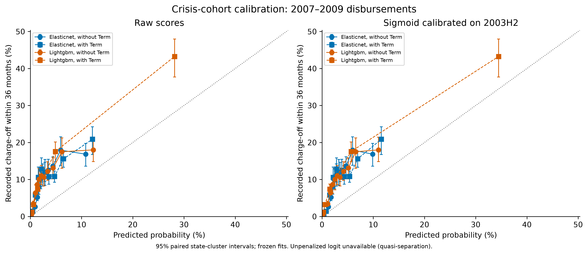

# Local economic conditions and public–lender loss sharing in SBA 7(a) lending

G2 gate report — 8 October 2026

**G2 computations concluded; the gate is not fully passed.** The frozen unpenalized specifications have quasi-separation and failed convergence. No finite primary logit associations, peak-path logit estimates or primary coefficient-resampled stress intervals are reported. Regularized scorecards and macro LightGBM robustness are reported separately; no replacement specification was selected.

The outcome is **recorded charge-off within 36 months**. Layer 1 uses reported approval descriptors (with explicitly unverified historical vintages); Layer 2 conditions on future realized or stipulated macro paths. Neither layer identifies causal effects of interest rates, guarantee shares or macro conditions.

## Sample and frozen comparisons

Official SBA 7(a), 30 June 2026 snapshot, 50 states/DC. The sequential waterfall, overlapping flags and cohort/status counts are in the linked tables. Mature EXEMPT/PIF rows remain eligible; severity anomalies do not remove charge-off outcomes.

| Sequential step | Excluded | Remaining |
|---|---:|---:|
| all_source_rows | 0 | 1,961,455 |
| wrong_program | 0 | 1,961,455 |
| cancelled_or_committed | 263,913 | 1,697,542 |
| unknown_status | 0 | 1,697,542 |
| missing_disbursement | 1,795 | 1,695,747 |
| incomplete_window | 160,527 | 1,535,220 |
| invalid_approval_amount | 1 | 1,535,219 |
| unmapped_state | 18,730 | 1,516,489 |
| date_or_status_contradiction | 1,637 | 1,514,852 |

| Role | Loans | Recorded charge-offs within 36 months |
|---|---:|---:|
| train | 405,443 | 14,003 |
| tune | 27,641 | 876 |
| calibrate | 31,955 | 1,426 |
| reference | 89,002 | 8,428 |
| crisis | 181,311 | 22,212 |
| oot | 120,002 | 1,787 |

Fit 1991–2002; tune 2003H1; sigmoid calibrate 2003H2; 2006 reference; crisis 2007–2009; later OOT 2011–2013. The macro match table verifies identical comparison samples. All labels used for fitting, tuning and calibration mature before 2007. No refit or test-cohort tuning.

## Layer 1: calibration and prediction

| Model | Term | Crisis AUC (95% interval) | Crisis average precision | Crisis Brier | Calibration intercept / slope |
|---|---|---:|---:|---:|---:|
| elasticnet | without | 0.623 [0.603, 0.640] | 0.155 | 0.111 | -0.289 / 0.556 |
| elasticnet | with | 0.655 [0.633, 0.671] | 0.179 | 0.110 | -0.061 / 0.624 |
| lightgbm | without | 0.627 [0.607, 0.644] | 0.165 | 0.111 | -0.316 / 0.545 |
| lightgbm | with | 0.902 [0.890, 0.911] | 0.527 | 0.080 | 0.293 / 0.716 |

Full tables retain **raw and calibrated** metrics, 999 paired state-cluster draws, undefined-draw counts, train-score-decile calibration, paired Term differences, later OOT, PSI, exact TreeSHAP checks and the fixed 70% score-allocation diagnostic. Intervals condition on frozen fitted models and do not include training/tuning uncertainty.

## Layer 2 and loss sharing

The finite unpenalized MLE does not exist under the frozen raw-category design: disclosed category levels contain only zero training outcomes. The failed attempts and exact category/count witnesses are preserved in CSV. Categories were not pooled/dropped and no penalty was substituted after looking at results. Interest rates are missing throughout training and their coefficient is unidentified.

On the crisis cohort, calibrated no-Term LightGBM mean PD is 5.30% in Layer 1 and 7.28% in the macro robustness model, versus a recorded rate of 12.25%. On the later OOT cohort, the macro model predicts 4.70% versus 1.49% recorded. The frozen calibration therefore transports poorly across these cohorts; discrimination alone does not validate the scenario PD levels.

The following **secondary LightGBM point projections** use the unchanged macro robustness models with frozen 2003H2 calibration. They are not the primary logit stress test and carry no coefficient-resampling intervals. A tree cannot extrapolate its year trend beyond training years. Support flags apply even where a tree returns a probability.

Baseline: 32 states and 61.2% of reference loans are outside at least one state-specific training range. Adverse: 51 states and 100.0% of reference loans are outside at least one state-specific training range.

**EAD = GrossApproval, CCF = 100%, full-disbursement proxy.** LGD is gross charged-off balance per approved dollar, not net recovery loss. The SBA/lender split is pro rata, not observed guarantee payouts or fiscal cost.

| Secondary scenario | LGD rule | Mean PD | EL proxy, USD m | SBA share, USD m | Lender share, USD m | EL / approval |
|---|---|---:|---:|---:|---:|---:|
| baseline | primary | 5.22% | 197.21 | 120.72 | 76.49 | 1.53% |
| adverse | primary | 7.54% | 294.76 | 179.84 | 114.92 | 2.29% |
| adverse | capped | 7.54% | 291.97 | 178.28 | 113.68 | 2.27% |
| adverse | downturn | 7.54% | 311.00 | 191.57 | 119.44 | 2.42% |

The with-Term secondary model reverses the ordering: baseline PD 7.73% versus adverse PD 6.38%. This sensitivity and widespread support failures preclude a reliable stress headline; better discrimination with reported Term does not verify its original vintage.

Term/revolving lines and the fixed size, sector, business-age and reported-maturity groups are reported separately. Full utilization of undrawn revolving commitments is an assumption, not an observed balance or universal upper bound.

## Predeclared sensitivities and gate status

| Item | Status | Evidence / qualification |
|---|---|---|
| Dated A2; protocol v1 retained | Done | Pre-fit commit `f611d18`; primary specification unchanged |
| Population, label, chronology, source hashes | Done | Waterfall, status/cohort counts, macro match, tests |
| ElasticNet / LightGBM with and without Term | Done | Fixed grids/budgets and failure counts in tuning/fit tables |
| Unpenalized Layer 1–2 logits | Attempted; failed | Quasi-separation witnesses; no finite MLE or usable clustered inference |
| Peak unemployment logit | Attempted; unavailable | Same controls/clusters; full 37-level path tested; same separation failure |
| Downturn LGD | Proxy done; primary application unavailable | 1991, 2000–2001 only; 1990 excluded; cell counts and type pooling; secondary adverse projection shown |
| Capped LGD | Done as secondary projection | Per-loan cap before the same training pooling; primary severity remains uncapped |
| Old-extract CCF | Not done, conditional gate unmet | Licence / exact administrative cutoff and maturity-qualified population unverified; no CSV acquired |
| Urban/rural; initial interest-rate coefficient | Unavailable | Source has no urban/rural field; training rate entirely missing |
| Primary stress PD/EL with coefficient intervals | Not estimable | No finite primary MLE; empty result schema preserves unavailable status |
| Secondary macro projections and support flags | Done | Separate point-only robustness table; no causal claim |
| Tests, preservation, local commits | See verification | Original artifacts retained; no pushes or G3 policy-date analysis |

Downturn proxy includes **3,221** valid recorded charge-offs across its loan-type/size cells. Sparse cells pool by type; `valid_cell_n`, `pooled_n` and pooling source are retained. The `ratios_above_one` count refers to the selected pool, so pooled rows must not be summed. Cohort exposure is not evidence that every charge-off occurred during a recession.

## Verification and execution

11 frozen model attempts: 6 converged, 5 unavailable. ElasticNet retains all 50 grid points per pair, including nonconverged trials excluded from selection; each LightGBM variant retains its 50 seeded trials. No budget was enlarged after seeing test results.

Local synthetic checks: **52 passed**; statistical-core coverage **96.57%** and package coverage **93.68%**. Lint and typing status: passed / passed. Production integrity checks cover the actual frozen rows; synthetic tests also exercise the converged-logit branch. Passing software tests does not validate a failed empirical MLE.

The bounded pilot and full-grid timings are retained. Independent frozen grids ran concurrently once; the final status/evaluation refresh reused verified checkpoints. Cached refresh time is not a fresh build time. A fresh end-to-end `make all` under two hours has not been established; remote CI was not run because nothing was pushed.

## Limitations and future work

A revised protocol would be needed before grouping sparse categories or choosing a regularized/Firth logit for inference. This gate does not authorize that change. Administrative charge-off timing is distinct from delinquency; EXEMPT is not certified performing status. Reported origination-feature vintages, missing historical rates and changing category support constrain the backtest. Revised BLS/FHFA series and containing-month/quarter alignment do not reconstruct real-time publication information. The fixed cohort-based LGD proxy omits recoveries and event-date balance vintages; gross approval is an assumed EAD. Conditional/tree projections omit training, calibration, LGD and full macro-path uncertainty. Old-extract utilisation ratios remain conditional on source admissibility. Loan approvals alone cannot identify rejected-applicant risk, guarantee-policy effects or the causal effect of local shocks. Survival/competing-risk methods, better vintage evidence and a separately approved inference repair belong to future work.

G3 policy-date design/outcome work and G5 report replacement/publication remain unstarted. Original V1 files and protocol v1 were verified by hash. Nothing was pushed.

## Sources and reproducibility

Primary [SBA FOIA](https://data.sba.gov/dataset/7a-504-foia), direct [BLS public API](https://www.bls.gov/developers/api_faqs.htm), and direct [FHFA all-transactions HPI](https://www.fhfa.gov/hpi/download/quarterly_datasets/hpi_at_state.csv). Raw observations stay private/ignored; hashes and acquisition metadata are published. **This product uses FHFA data but is neither endorsed nor certified by FHFA.**

Frozen YAML/seed and uv lock: `make setup`, `make data`, `make all`; `make test`, `make lint`, `make quick` use synthetic checks. Data acquisition is cached and bounded. No FRED observations or credentials are used. Run `make report` only to regenerate the gate figures/summary, not the old G5 PDFs.

Tables: [sample waterfall](../results/g2-2026-10-08/sample_waterfall.csv), [evaluation](../results/g2-2026-10-08/evaluation_metrics.csv), [separation witnesses](../results/g2-2026-10-08/separation_witnesses.csv), [state validation](../results/g2-2026-10-08/state_validation.csv), [secondary stress](../results/g2-2026-10-08/stress_lightgbm_secondary.csv), [downturn LGD](../results/g2-2026-10-08/lgd_downturn.csv). See the aggregate directory index for the remaining diagnostics, intervals and sensitivities.
